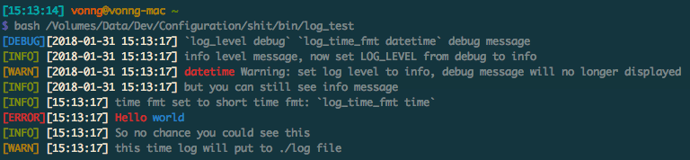

Configuration
-----------------------------
Vonng's configuration files (Mostly bash)

## Install

```bash
make
```

### Install Bash 4.x in MacOS

since macOS use bash 3.x by default due to GPL issue , you may consider upgrade to bash 4.x manually.

```bash
# Step 1 : Install Homebrew
ruby -e "$(curl -fsSL https://raw.githubusercontent.com/Homebrew/install/master/install)"

# Step 2 : Install Bash via homebrew
brew update && brew install bash

# Step 3 : Register 4.x bash
sudo bash -c 'echo /usr/local/bin/bash >> /etc/shells'

# Step 4 : Change your default bash
chsh -s /usr/local/bin/bash

# Notice : use `#!/usr/bin/env bash` instead of `#!/bin/bash` in scripts
# Notice : Change IEDA-Settings-Terminal to use /usr/local/bin/bash
```


## Example

Lot's of bash utils, here is exmaple of library `color` and `log`

```bash
#!/usr/bin/env bash


source ${HOME}/.shit/main

import color
import log

log_level debug
log_time_fmt datetime

log_debug '`log_level debug` `log_time_fmt datetime` debug message'
log_info info level message, now set LOG_LEVEL from debug to info

log_level info
log_warn $(color_msg r "datetime") "Warning: set log level to info, debug message will no longer displayed"
log_debug "now you can't see debug message"
log_info "but you can still see info message"

log_time_fmt t
log_info "time fmt set to short time fmt: " '`log_time_fmt time`'
log_error $(color_msg r Hello) $(color_msg blue world)

#log_fatal "fatal message will exit script directly"
log_info "So no chance you could see this"
log_warn "this time log will put to ./log file"


# switch output to file (disable color)
# LOG_PATH="./log"
```

And here comes the output:




## Description

* Bash Library : `shit`  (abbrev of shell-it)
    * [main](./shit/main)  : Library Loader
    * [shitrc](bash/bashrc) : Startup Script
    * [shit-lib](./shit/lib) : Lot's of utils
* Git Settings
    * [gitconfig](git/gitconfig)
* App Settings
    - [Karabiner-Capslock](app/karabiner/)
    - [AutoHotKey-Capslock](app/ahk/)
* SSH Settings: [Private]
* Binary utils: [Private]

